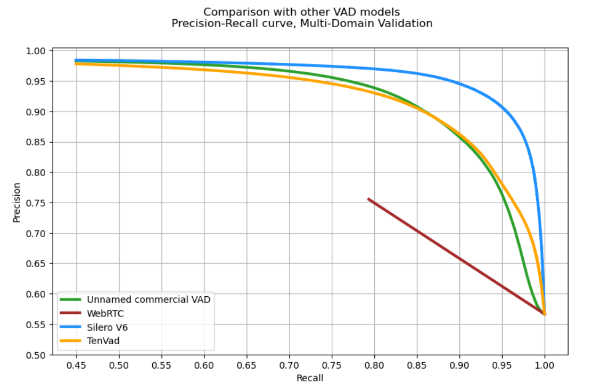

# Silero VAD (Rust)

Rust port of the [Silero Voice Activity Detector](https://github.com/snakers4/silero-vad) that runs the pre-trained ONNX models through the safe `ort` bindings. The crate bundles the original ONNX weights and exposes idiomatic Rust helpers for loading audio, running the network, and post-processing speech segments.



## Features

- 🌍 **Universal** — Silero VAD was trained on massive corpora covering 6,000+ languages, so it performs well across domains and under noisy conditions.
- 🧠 **Pre-trained accuracy** — ships with Silero ONNX models (`opset 15` & `16`) inside `src/silero_vad/data`, so no extra downloads are required.
- 🖥️ **CPU friendly** — defaults to ONNX Runtime’s CPU execution provider for predictable server and edge runs, while keeping other providers available if you reconfigure `LoadOptions`.
- 🔄 **Streaming ready** — `forward_chunk` keeps internal state for long-running streams, while `audio_forward` processes entire buffers offline.
- 🎚️ **Configurable thresholds** — `VadParameters` lets you tune thresholds, speech/silence windows, and return units (samples or seconds) for rapid adaptation to new setups.
- 🔧 **Helper APIs** — ships with `read_audio`, `save_audio`, `get_speech_timestamps`, `collect_chunks`, `drop_chunks`, and `VadIterator` for quick end-to-end adoption.

## Installation

```bash
cargo add silero-vad-rust
```

The crate expects the ONNX Runtime shared library to be discoverable at runtime (`ort` with `load-dynamic`). See the [ort crate docs](https://docs.rs/ort/) if you need to pin a specific runtime build.

## Quick Start

### Offline Pass

```rust
use silero_vad_rust::{get_speech_timestamps, load_silero_vad, read_audio};
use silero_vad_rust::silero_vad::utils_vad::VadParameters;

fn main() -> anyhow::Result<()> {
    let audio = read_audio("samples/test.wav", 16_000)?;
    let mut model = load_silero_vad()?; // defaults to ONNX opset 16
    let params = VadParameters {
        return_seconds: true,
        ..Default::default()
    };

    let speech = get_speech_timestamps(&audio, &mut model, &params)?;
    println!("Detected segments: {speech:?}");
    Ok(())
}
```

### Streaming Chunks

```rust
use silero_vad_rust::{load_silero_vad, read_audio};

fn stream_chunks() -> anyhow::Result<()> {
    let audio = read_audio("samples/long.wav", 16_000)?;
    let mut model = load_silero_vad()?;
    let chunk_size = 512; // 16 kHz window

    for frame in audio.chunks(chunk_size) {
        let padded = if frame.len() == chunk_size {
            frame.to_vec()
        } else {
            let mut tmp = vec![0.0f32; chunk_size];
            tmp[..frame.len()].copy_from_slice(frame);
            tmp
        };

        let probs = model.forward_chunk(&padded, 16_000)?;
        println!("frame prob={:.3}", probs[[0, 0]]);
    }

    Ok(())
}
```

### Segment Trimming & Muting

```rust
use silero_vad_rust::{
    collect_chunks, drop_chunks, get_speech_timestamps, load_silero_vad, read_audio, save_audio,
};
use silero_vad_rust::silero_vad::utils_vad::VadParameters;

fn trim_audio() -> anyhow::Result<()> {
    let audio = read_audio("samples/raw.wav", 16_000)?;
    let mut model = load_silero_vad()?;
    let params = VadParameters {
        return_seconds: false,
        ..Default::default()
    };
    let speech = get_speech_timestamps(&audio, &mut model, &params)?;

    let voice_only = collect_chunks(&speech, &audio, false, None)?;
    save_audio("out_voice.wav", &voice_only, 16_000)?;

    let muted_voice = drop_chunks(&speech, &audio, false, None)?;
    save_audio("out_silence.wav", &muted_voice, 16_000)?;
    Ok(())
}
```

### Event-Driven Iterator

```rust
use silero_vad_rust::{
    load_silero_vad, read_audio,
    silero_vad::utils_vad::{VadEvent, VadIterator, VadIteratorParams},
};

fn iterate_events() -> anyhow::Result<()> {
    let audio = read_audio("samples/live.wav", 16_000)?;
    let model = load_silero_vad()?;
    let params = VadIteratorParams {
        threshold: 0.55,
        ..Default::default()
    };
    let mut iterator = VadIterator::new(model, params)?;

    for frame in audio.chunks(512) {
        let event = iterator.process_chunk(frame, true, 1)?;
        if let Some(VadEvent::Start(ts)) = event {
            println!("speech started at {ts}s");
        } else if let Some(VadEvent::End(ts)) = event {
            println!("speech ended at {ts}s");
        }
    }

    Ok(())
}
```

### Enabling GPU Runtime

```rust
use silero_vad_rust::silero_vad::model::{load_silero_vad_with_options, LoadOptions};

fn load_gpu_model() -> anyhow::Result<()> {
    let options = LoadOptions {
        opset_version: 15,
        force_onnx_cpu: false, // allow custom providers (GPU, NNAPI, etc.)
        ..Default::default()
    };
    let _model = load_silero_vad_with_options(options)?;
    Ok(())
}
```

> To actually run on GPU, enable the matching `ort` feature in your own `Cargo.toml` (for example `ort = { version = "2.0.0-rc.10", features = ["load-dynamic", "cuda"] }`) and point `ORT_DYLIB_PATH` (or your system library path) to a GPU-enabled ONNX Runtime binary. With `force_onnx_cpu = false`, the runtime will use whatever providers were compiled into that library; if you need to prioritize a specific provider (e.g. CUDAExecutionProvider), extend `OnnxModel::from_path` to register it explicitly.

### Tuning Parameters

```rust
use silero_vad_rust::{get_speech_timestamps, load_silero_vad, read_audio};
use silero_vad_rust::silero_vad::utils_vad::VadParameters;

fn compare_thresholds() -> anyhow::Result<()> {
    let audio = read_audio("samples/noisy.wav", 16_000)?;
    let mut model = load_silero_vad()?;

    let mut strict = VadParameters::default();
    strict.threshold = 0.65;
    strict.min_speech_duration_ms = 400;

    let mut permissive = VadParameters::default();
    permissive.threshold = 0.4;
    permissive.min_speech_duration_ms = 150;

    let strict_segments = get_speech_timestamps(&audio, &mut model, &strict)?;
    model.reset_states();
    let permissive_segments = get_speech_timestamps(&audio, &mut model, &permissive)?;

    println!("strict count: {}", strict_segments.len());
    println!("permissive count: {}", permissive_segments.len());
    Ok(())
}
```

## Build & Test

```bash
cargo fmt
cargo clippy --all-targets
cargo test
```

Integration tests use WAV fixtures in `tests/data`.

## Configuration Notes

- `load_silero_vad_with_options` lets you pick `opset_version` 15/16 and toggle `force_onnx_cpu`.
- TorchScript weights are intentionally unsupported in this port; always pass `use_onnx = true`.
- When building without audio I/O, disable the default feature: `cargo build --no-default-features`.

## Application Scenarios

- Voice activity detection for IoT / edge / mobile deployments
- Offline data cleaning and generic voice-detection pipelines
- Telephony, call-center automation, and voice bots
- Voice interfaces and conversational UX layers

## License

Distributed under the MIT License, matching the upstream Silero VAD project. See `LICENSE` for details.
